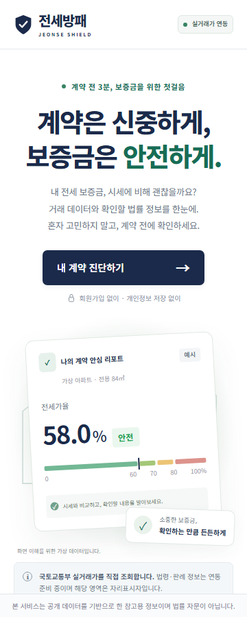
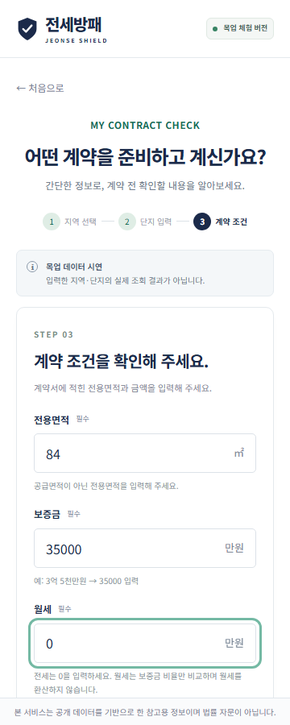
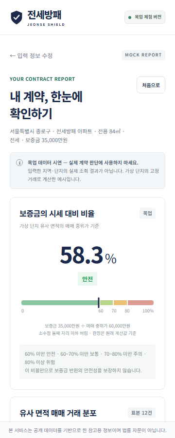

# 전세방패 (Jeonse Shield)

전월세 계약 전 3분 만에 끝내는 보증금 위험 진단 서비스입니다.

국토교통부 실거래가와 법제처 국가법령정보를 직접 조회합니다. 서로 다른 두 질문에 각각 답합니다.

| 질문 | 기준 | 화면 |
|---|---|---|
| 이 보증금이 바가지인가 | 같은 단지·유사 면적 **전세 실거래 보증금** 중위가 | 메인 카드 |
| 보증금을 못 받을 위험이 있나 | 같은 단지·유사 면적 **매매** 중위가 (전세가율) | 두 번째 카드 |

여기에 대항력·우선변제권 등 4개 쟁점의 대법원 판례를 AI가 쉬운 말로 요약하되, 판시사항 원문을 항상 함께 싣습니다.

**공개 URL**: https://b804b5ca-b467-4435-a6bb-9a0bd5ceee5b.vip.gensparksite.com

> 참고용 정보이며 법률 자문이 아닙니다. 권리관계·선순위 담보·임대인 상태는 포함되지 않습니다.

## 실행 방법

Node.js 20 이상이 필요합니다.

```sh
npm ci
npm run build
npm run dev:sandbox
```

로컬 주소: http://localhost:3000

테스트:

```sh
npm test                      # 단위·라우트 테스트
node tests/browser.mjs        # 브라우저 검사
```

브라우저 테스트 최초 준비: `npx playwright install --with-deps chromium`

백그라운드로 띄우려면 pm2를 쓸 수 있습니다(선택).

```sh
npx pm2 start ecosystem.config.cjs
```

## 기술 스택

Hono / 순수 JavaScript / Vite Pages 빌드 / Cloudflare Workers / 직접 그린 SVG. Node 내장 모듈은 빌드·테스트 도구에서만 사용하며 Worker와 프론트엔드에서는 사용하지 않습니다. 차트·UI 라이브러리와 외부 폰트·이미지 요청은 없습니다.

## 완료 기능과 사용법

1. 랜딩의 ‘내 계약 진단하기’를 선택합니다.
2. 시도 → 시군구를 고르면 그 지역에서 최근 6개월 실제로 거래된 단지 목록을 불러옵니다.
3. 목록에서 단지를 고르고 전용면적·보증금·월세를 입력합니다.
4. 결과를 확인합니다. 위에서부터 ① 같은 단지 전세 시세와 비교 ② 보증금 반환 위험(전세가율) ③ 유사 면적 매매 거래 분포(접힘) ④ 계약 전 체크리스트 ⑤ 법령·판례 4개 쟁점 순입니다.

단지를 자유 입력이 아니라 목록에서 고르게 한 이유는 매매 응답에 단지 고유 ID(`aptSeq`)가 없기 때문입니다. 전월세와 매매를 잇는 키가 단지명 문자열뿐이라, 오타나 표기 차이로 매칭이 실패하면 "표본 부족"과 구분되지 않습니다. 선택 시점에 키가 확정되면 그 실패가 사라집니다.

보증금·월세는 만원 단위이며 **월세를 전세로 환산하지 않습니다.** 전세 시세 표본에서 월세 있는 계약을 빼고, 계약 자체가 월세면 전세 시세 대비 비율을 내지 않고 분포만 보여 줍니다. 전월세 전환율을 가정하는 순간 어느 신고에도 없는 숫자가 화면에 찍히기 때문입니다.

표본 3건 미만은 전세·매매 양쪽 모두 비율·통계·마커를 숨기고, 왜 판정할 수 없는지를 구분해 안내합니다. 매매 쪽은 거래가 아예 없는 경우와 표본이 얇은 경우를, 전세 쪽은 전월세 기록이 없는 경우·전부 월세인 경우·해당 면적대에 전세가 없는 경우·표본이 얇은 경우를 각각 다르게 말합니다. "표본 부족"으로 뭉뚱그리면 표본을 더 모아도 해결되지 않는 상황이 그렇게 읽히기 때문입니다.

전세 시세 대비는 위험 등급이 아니라 위치 표시입니다. 시세보다 비싸게 계약하는 것은 깡통전세와 다른 문제이므로 경고색을 쓰지 않습니다(100% 미만 시세보다 낮음 / 100~110% 시세 수준 / 110% 이상 시세보다 높음). 해제된 거래(`cdealType`)는 중위가 계산 전에 제외하고 몇 건을 제외했는지 화면에 표시합니다. 분포 Q1/Q3은 nearest-rank이고 중위가는 짝수 표본의 중앙 두 값 평균입니다.

## 진입 경로

- `/#home`: 랜딩
- `/#diagnosis`: 3단계 입력
- `/#result`: 입력을 완료한 현재 탭의 진단 결과. 새로고침하면 입력 상태가 사라져 홈으로 돌아갑니다.
- `/data/lawd.json`: 정적 법정동코드
- `/api/health`: 실행 상태
- `/api/month?kind=rent|trade&lawdCd=11110&ym=202606`: 한 지역의 한 달 실거래 내역. 브라우저가 월별로 병렬 호출하고 집계는 클라이언트에서 합니다.

## 데이터 구조 및 출처

- 거래: `/api/month` 가 돌려주는 정규화 행. 매매는 `{ name, key, area, price, floor, year, month, day, cancelled }`, 전월세는 `price` 대신 `{ deposit, monthlyRent }`. 금액 단위는 만원.
- 법정동: `[{ sido, items: [{ code, name }] }]`. 공식 원본 53,387행에서 필터링하여 16개 시도 그룹·256개 선택 항목. 시도 자체 행은 그룹 제목이며, 세종 36110 포함.
- 자치구를 가진 시의 상위 코드 13개(수원·성남·안양·부천·안산·고양·용인·화성·청주·천안·포항·창원·전주)는 **제외**했습니다. 실거래가 API가 이들 코드에 `totalCount=0`으로 응답합니다. 데이터는 자치구 코드에만 있습니다.
- 행정구역 개편 이후 **신설 코드가 정답**입니다. API가 과거 거래까지 신설 코드로 마이그레이션해 두었습니다. 예) 광주 서구 신 `12240` 355건 / 구 `29155` 0건.
- 위 두 항목은 2026-09-21 실제 키로 전수 실측해 확인했습니다.
- 공식 원본: https://www.code.go.kr/stdcode/regCodeL.do — 2026-09-21 수집, ZIP 내부 파일 시각 2026-09-17. 개별 코드 시행 기준일은 미확인.
- 재생성: `python scripts/extract-lawd.py`. 원본과 메타데이터는 `research/`.
- 예정 API: 국토교통부 아파트 전월세/매매 실거래가(https://www.data.go.kr), 법제처 국가법령정보 공동활용(https://open.law.go.kr).
- 실거래가 응답은 `kind+지역+월` 단위로 D1에 24시간 캐시합니다. 법령 API는 아직 호출하지 않습니다. 입력과 체크 상태는 화면 메모리에서만 사용하며 서버·localStorage·sessionStorage에 저장하지 않습니다.

## 배포 상태 및 설정

- 프로덕션: https://b804b5ca-b467-4435-a6bb-9a0bd5ceee5b.vip.gensparksite.com (2026-09-22)
- 구 URL `ee28b90e-b6b6-441a-be3e-dc934c68e7a5.vip.gensparksite.com` 은 1일차 목업이 남아 있습니다. `/api/health` 가 `"mode":"mock"` 을 돌려주고 `/api/month`·`/api/law` 는 404입니다. 사용하지 마십시오.
- 배포는 Genspark 환경에서만 가능합니다. `npm run deploy` 가 부르는 `gsk` CLI가 그쪽에만 있습니다.
- Genspark Workers for Platform 배포. 1일차 작업 보고서는 `REPORT.md`, 설계는 `docs/DESIGN.md` 참조.
- 관리 D1 이름: `ee28b90e-b6b6-441a-be3e-dc934c68e7a5-db`, 실제 ID `b0f9e541-9ed1-4943-9a0e-75b934815f64`. 사용자 테이블·뷰·인덱스는 0개.
- `wrangler.jsonc`: Pages 빌드 출력 `dist`, D1 바인딩 `DB` 1개. KV와 Node 호환 플래그 없음.
- 정적 파일: 빌드 시 `public/`을 `dist/`로 복사, Pages 및 Hosted의 네이티브 `ASSETS.fetch`로 서빙. KV manifest 기반의 구형 Workers static helper는 사용하지 않음. Hono 빌드 옵션 `emptyOutDir: true`로 오래된 출력 정리.
- 시크릿: 로컬은 git이 무시하는 `.dev.vars`, 배포본은 `gsk hosted secret_put`. 코드에서는 `c.env.DATA_GO_KR_KEY` 로만 읽으며 프론트엔드 번들·소스·`wrangler.jsonc` 어디에도 문자열로 넣지 않습니다.
- 빌드 산출물에 키가 없는지 확인: `npm run build && grep -r "DATA_GO_KR_KEY\|serviceKey" dist/`

## 실거래가 API 확인 결과 (2026-09-21)

실제 서비스키로 호출해 확인한 사실입니다.

| 엔드포인트 | 결과 |
|---|---|
| `RTMSDataSvcAptRent/getRTMSDataSvcAptRent` | 200 |
| `RTMSDataSvcAptTrade/getRTMSDataSvcAptTrade` | 200 |
| `RTMSDataSvcAptTradeDev/getRTMSDataSvcAptTradeDev` | **403** — "상세 자료"는 별도 API |
| `RTMSDataSvcRHRent`, `RTMSDataSvcRHTrade` | 200 |

응답 필드명은 모두 영문입니다.

- 전월세: `aptNm`, `aptSeq`, `excluUseAr`, `deposit`, `monthlyRent`, `floor`, `dealYear`/`dealMonth`/`dealDay`, `umdNm`, `sggCd`, `buildYear`, `contractTerm`, `contractType`
- 매매: `aptNm`, `aptDong`, `excluUseAr`, `dealAmount`, `floor`, `dealYear`/`dealMonth`/`dealDay`, `umdNm`, `sggCd`, `cdealDay`, `cdealType`, `dealingGbn`
- 연립다세대는 단지명이 `mhouseNm`이며 `houseType`, `landAr`이 추가됩니다.

금액(`deposit`, `dealAmount`)은 만원 단위이며 `96,000`처럼 콤마가 포함됩니다.

연동 시 주의할 점 두 가지입니다.

1. **매매 응답에는 `aptSeq`가 없습니다.** 전월세와 매매를 잇는 키가 `aptNm` 문자열뿐이므로 단지 매칭은 이름 정규화(괄호·공백·특수문자 제거)에 의존해야 합니다.
2. **해제된 거래가 섞여 있습니다.** `cdealType`이 `해제`인 행은 취소된 거래이므로 중위가 계산 전에 제외해야 합니다.

`Access-Control-Allow-Origin`은 200 응답에도 요청 Origin을 에코합니다. 브라우저 직접 호출은 가능하지만, 서비스키 노출을 막기 위해 서버 프록시를 유지합니다.

## 알려진 한계

한 지역·한 달에 대해 **첫 200건만** 조회합니다(`numOfRows=200`, 페이지네이션 없음). 거래가 많은 구에서는 상당수가 빠집니다.

| 지역 | 2026-06 전월세 실제 | 조회 | 누락 |
|---|---|---|---|
| 강남구 `11680` | 2,096 | 200 | 1,896 |
| 광주 서구 `12240` | 355 | 200 | 155 |
| 수원 장안구 `41111` | 337 | 200 | 137 |

실측(강남구 `11680` 2026-06 매매)에서 남은 200건은 1일~30일에 고르게 분포했고(5일 단위 45/30/30/34/28/33) 14개 법정동이 모두 포함됐습니다. **특정 시기가 통째로 빠지는 형태는 아닙니다.**

대신 줄어드는 것은 **단지별 표본 깊이**입니다. 그 200건은 110개 단지에 흩어져 매매 3건 이상인 단지가 19곳뿐이었습니다. 거래가 많은 구일수록 실제 거래량에 비해 `판정 불가`가 자주 나옵니다. 브라우저가 6개월을 조회해 이를 완화합니다.

**의도적으로 고치지 않았습니다.** `totalCount` 페이지네이션은 요청당 CPU 10ms 예산이 이미 제약하는 파싱 비용을 배로 늘립니다. 표본이 얇으면 판정을 포기하는 것이 이 서비스의 문서화된 동작이므로, 이 절단은 정확성이 아니라 적용 범위를 줄입니다. 자세한 내용은 `docs/DESIGN.md` 11-b절에 있습니다.

## 미구현 및 다음 단계

법령·판례 조회와 LLM 요약, 연립다세대·단독다가구는 다음 단계입니다. 로그인·결과 저장·지도는 범위 밖입니다.

## 스크린샷

| 랜딩 | 입력 위저드 | 결과 리포트 |
|---|---|---|
|  |  |  |

`docs/screenshots/`의 이미지는 `node tests/browser.mjs`가 `artifacts/`에 남긴 캡처에서 가져온 것입니다. 화면을 바꾼 뒤에는 테스트를 실행하고 세 파일을 다시 복사해 주세요.

## 검증과 보고서

단위·라우트 75개 통과. Chromium 360/390/768/1440px의 브라우저 검사 61개 통과. 가로 넘침·입력 검사·표본 부족·월세·100% 초과·체크리스트·XSS·세종·네트워크 오류, 게이지 눈금 줄바꿈, 차트에 표에 없는 숫자가 나오지 않는지, 법적 고지가 한 번만 표시되는지를 검증합니다.

```sh
npm test               # 단위·라우트
node tests/browser.mjs # 브라우저 (결과는 artifacts/ 에 기록)
```

`artifacts/`는 테스트 실행 때마다 새로 쓰이는 산출물이라 저장소에 포함하지 않습니다. 1일차 작업 보고서는 `REPORT.md`에 있습니다.

MIT License. 본 서비스는 참고용 정보이며 법률 자문이 아닙니다.
